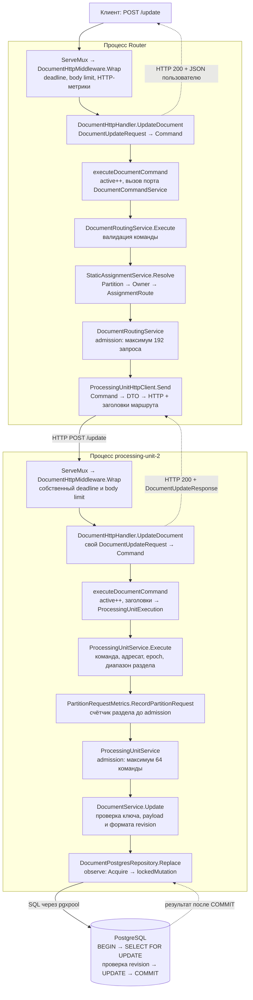
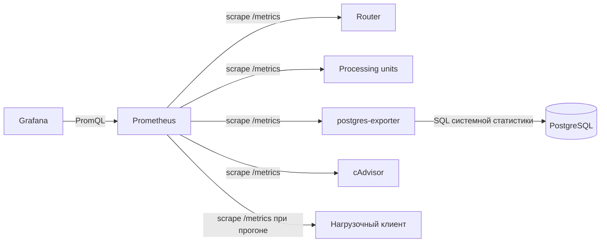

# Текущая архитектура

Документ описывает реализованный код. План развития — в [roadmap](roadmap.md), сетевой протокол и границы текущего эпика — в [эпике 1](epics/epic-1/README.md). Полная последовательность вызовов приведена ниже в разделе «Путь пользовательского запроса».

## Два отдельных сервиса

| Приложение | Точка входа | Сборка зависимостей | Конфиг | Dockerfile |
|---|---|---|---|---|
| Router | `router/cmd/router` | `router/internal/app` | `router/config.yaml` | `router/Dockerfile` |
| processing unit | `processing-unit/cmd/processing-unit` | `processing-unit/internal/app` | `processing-unit/config.yaml` | `processing-unit/Dockerfile` |

Каждый образ содержит собственный бинарник. Переключателя `--role` нет. Router не импортирует PostgreSQL-репозиторий и код processing unit; processing unit не импортирует Router или его исходящий клиент. Корень — общая директория монорепозитория. Router, processing unit и нагрузочный клиент имеют независимые Go-модули и Docker build contexts. Между ними нет Go-импортов, `replace` или общего runtime-пакета. Небольшие модели, DTO и утилиты локальны каждому приложению. Совместимость определяет [сетевой контракт](epics/epic-1/api.md), а не общий исходный код.

Router сейчас выполняет маршрутизацию команд на статической топологии. Это data-plane функция. API управления, публикация назначений и автоскейлинг control plane пока не реализованы; для них нужны отдельные прикладные сервисы, а не расширение HTTP-хендлера CRUD.

## Ответственность слоёв

- **Transport:** декодирует DTO, преобразует его в `document.Command`, передаёт метаданные запроса сервису и преобразует результат/ошибку в HTTP-ответ. Здесь остаются HTTP-лимит тела, deadline и метрики запросов.
- **Service:** проверяет сущности, выбирает владельца, проверяет назначение processing unit, ограничивает число выполняемых команд и вызывает зависимости через узкие порты. Не импортирует HTTP DTO, pgx или Prometheus.
- **Repository:** выполняет SQL и обеспечивает атомарные гарантии хранения. Не принимает решений о маршрутизации.

`internal/document/transport/http` каждого приложения содержит свой входной адаптер. Router передаёт сервису только команду; processing unit преобразует заголовки выбранного маршрута в `service.ProcessingUnitExecution`. HTTP-слои не вычисляют раздел и не выбирают адресата.

## Путь команды

```text
Router HTTP → DTO → document.Command → router/document/service.DocumentRoutingService
  → resolve partition/owner → admission → ProcessingUnitClient.Send(selected route, command)
  → router/processingunit/client/http.ProcessingUnitHttpClient → HTTP запрос на выбранную processing unit

processing unit HTTP → DTO → document.Command + Execution → processing-unit/processingunit/service.ProcessingUnitService
  → validate destination/epoch/partition range → admission → document/service.DocumentService
  → Repository → document/repository/postgres.DocumentPostgresRepository
```

`DocumentRoutingService` игнорирует присланную внешним клиентом epoch и использует версию своей карты. `ProcessingUnitHttpClient` получает готовый маршрут, кодирует запрос и преобразует ответ обратно в доменные значения. Он не выбирает владельца и не повторяет запросы.

`ProcessingUnitService` до обращения к CRUD-сервису проверяет адресата, epoch и границы номера раздела. Запрос, адресованный другому идентификатору ноды, не достигает репозитория. Метрика распределения нагрузки вызывается через `PartitionRequestObserver`; конкретный Prometheus observer находится в приложении processing unit. Условное обновление revision и commit остаются гарантией PostgreSQL-репозитория.

`document/service.DocumentService` отвечает только за CRUD-инварианты. Существующие интерфейсы `DocumentRepository`, `ProcessingUnitClient` и `AssignmentResolver` определены у потребителей. Конкретные прикладные сервисы не заменены пустыми интерфейсами.

## Технический код и конфигурация

`internal/utils` каждого приложения содержит свой загрузчик YAML и жизненный цикл HTTP-сервера: health, metrics endpoint, shutdown. Типы конфигов компонентов находятся у потребителей. В Router-конфиге нет PostgreSQL, в processing unit-конфиге нет настроек исходящего клиента. Топология и адреса нод находятся только в Router. Processing unit хранит локальные `processing.epoch` и `processing.partition_count`, согласованные с Router; ни хеширования ключа, ни карты владельцев у него нет. Корректность соответствия ключа, раздела и владельца обеспечивает Router. Проверка адресата не является доказательством владения или fencing.

`benchmarks/load` остаётся отдельным модулем и HTTP-клиентом; приложение не запускает нагрузку или тесты. Каждое приложение содержит собственный `Dockerfile.test`. API операций и имена основных метрик сохранены. `storage_active_requests` измеряет выполняемые вызовы прикладного сервиса; отказы admission учитываются отдельными статусами 429.

Метрика `storage_topology_nodes` публикуется только Router. Processing unit учитывает фактически полученные разделы; до первого запроса соответствующая серия отсутствует.

## Единая структура и имена

Файлы используют snake_case основного типа, тесты — то же имя с `_test.go`. Например, `DocumentPostgresRepository` находится в `document_postgres_repository.go`. Технические адаптеры принадлежат функциональности, которую обслуживают:

```text
processing-unit/internal/
  document/
    domain/                         # Key, Payload, Record, Command
    service/
      document_service.go           # DocumentService
      document_repository.go        # DocumentRepository — порт хранения
    repository/postgres/
      document_postgres_repository.go
      document_postgres_config.go
      document_postgres_metrics.go
    transport/http/
      document_http_handler.go
      document_http_config.go
      document_command_service.go
    transport/dto/
      document_create_request.go
      document_create_response.go
      document_get_request.go
      document_get_response.go
      document_update_request.go
      document_update_response.go
      document_delete_request.go
      document_delete_response.go
      document_error_response.go
  processingunit/
    service/processing_unit_service.go
    service/processing_unit_service_config.go
    metrics/partition_request_metrics.go
router/internal/
  assignment/
    domain/assignment_node.go
    domain/assignment_route.go
    service/assignment_config.go
    service/static_assignment_service.go
  document/
    domain/
    service/document_routing_service.go
    service/assignment_resolver.go
    service/processing_unit_client.go
    transport/http/document_http_handler.go
  processingunit/client/http/
    processing_unit_http_client.go
    processing_unit_http_client_config.go
```

`StaticAssignmentService` вычисляет раздел и владельца по проверенному снимку конфигурации. `AssignmentConfig` отвечает за чтение и валидацию параметров. Модели `AssignmentNode` и `AssignmentRoute` описывают результат, не выполняя маршрутизацию. Порт `ProcessingUnitClient` находится у потребителя в `document/service`, его HTTP-реализация — в `processingunit/client/http`.

DTO каждой операции находится в `document/transport/dto`. HTTP-адаптер выбирает тип по endpoint; Router использует те же локальные DTO в исходящем клиенте, без импорта входного HTTP-обработчика. Нагрузочный клиент содержит собственные DTO create/get/update в `benchmarks/load/transport/dto` и читает из ответов только нужную ему revision.

HTTP-маршруты регистрируются явно в `document/transport/http/document_http_routes.go`: `POST /create`, `/get`, `/update`, `/delete`. Одна структура `DocumentHttpHandler` содержит методы `CreateDocument`, `GetDocument`, `UpdateDocument`, `DeleteDocument`: каждый читает свой DTO и формирует свой ответ. Методы находятся вместе в `document_http_handler.go`; отдельные структуры и файлы на операцию не создаются. Единый `DocumentHttpMiddleware` использует `DocumentHttpConfig` для deadline, лимита тела, обработки ошибок и HTTP-метрик. Разбор пути и выбор DTO через switch в общем обработчике запрещены. Общий порт Execute сохраняет доменную команду для маршрутизации/admission; он не занимается HTTP-диспетчеризацией.

## Общее правило transport-слоя

Эта структура применяется ко всем сущностям и приложениям, включая будущие сервисы. На сущность создаётся один `<Entity>HttpHandler` в `<entity>_http_handler.go`, а операции реализуются его методами. Отдельный `<entity>_http_routes.go` связывает HTTP-метод и путь с конкретным методом обработчика. Общие настройки и middleware не дублируются по операциям. DTO остаются отдельными для каждой операции в `transport/dto`.

Сейчас предметные входные обработчики есть в Router и processing unit; оба используют эту структуру. Нагрузочный клиент имеет собственные исходящие DTO. Служебные `/livez`, `/readyz`, `/metrics` и `/status` остаются инфраструктурными endpoint и не требуют искусственного доменного слоя.

## Путь пользовательского запроса

Схема отражает текущий код, а не целевой control plane. Сетевые участники: **клиент → Router → один processing unit → PostgreSQL**. Классы с суффиксом Service — объекты внутри процессов; вызовы между ними обычные вызовы Go. Другие processing units не участвуют в обработке выбранного запроса. Все исполнители используют одну PostgreSQL и общую таблицу `documents`.

### Пример выбора исполнителя

```http
POST /update
Content-Type: application/json

{"partition_key":"abc","id":"doc-1","payload":{"name":"Maria"},"expected_revision":"<текущая revision>"}
```

Для успешного update запись должна уже существовать, а revision — совпадать. В текущем `router/config.yaml` 128 разделов и упорядоченные ноды 1, 2, 3:

```text
SHA-256(UTF-8("abc")), первые 8 байт unsigned big-endian
  → modulo 128 = 106
  → индекс владельца 106 modulo 3 = 1 (индексация с нуля)
  → processing-unit-2, http://processing-unit-2:8080, epoch="1"
```

Router выбирает владельца по `partition_key`, не по `id`, загрузке или доступности нод. Автоматического переключения на другую ноду и повторов записи нет.

### Общая карта вызовов



Сплошные стрелки показывают порядок обработки, пунктир — основные возвраты. Между ними результат возвращается по стеку Go-вызовов в обратном порядке. Admission — получение слота без ожидания: свободного слота нет → 429. Ожидание свободного соединения PostgreSQL, напротив, возможно и ограничено контекстом.

### Подробная последовательность update

```mermaid
sequenceDiagram
    autonumber
    actor C as Клиент
    participant RT as Router: mux + middleware
    participant RH as Router: DocumentHttpHandler
    participant RS as DocumentRoutingService
    participant AS as StaticAssignmentService
    participant HC as ProcessingUnitHttpClient
    participant PT as Unit-2: mux + middleware
    participant PH as Unit-2: DocumentHttpHandler
    participant PS as ProcessingUnitService
    participant DS as DocumentService
    participant RE as DocumentPostgresRepository
    participant Pool as pgxpool
    participant DB as PostgreSQL

    C->>RT: POST /update + JSON
    RT->>RT: Выбрать маршрут, deadline 4s, MaxBytesReader 1 MiB
    RT->>RH: UpdateDocument(w, r)
    RH->>RH: decodeDocumentRequest: строгий JSON, один DTO
    RH->>RH: request.Command(), executeDocumentCommand: active++
    RH->>RS: Execute(ctx, Command) через порт DocumentCommandService
    RS->>RS: Command.Validate()
    RS->>AS: Resolve(partition_key)
    AS->>AS: Partition(key), Owner(partition)
    AS-->>RS: partition=106, node=unit-2, epoch=1
    RS->>RS: Получить admission-слот или вернуть ErrOverloaded
    RS->>HC: Send(ctx, route, Command) через порт ProcessingUnitClient
    HC->>HC: documentRequest → JSON; выставить X-Partition-ID, X-PU-ID, X-Assignment-Epoch
    HC->>PT: HTTP POST http://processing-unit-2:8080/update
    PT->>PT: Выбрать маршрут, собственный deadline 3s, лимит 1 MiB
    PT->>PH: UpdateDocument(w, r)
    PH->>PH: decodeDocumentRequest → свой DTO → Command
    PH->>PH: executeDocumentCommand: active++, разобрать заголовки в ProcessingUnitExecution
    PH->>PS: Execute(ctx, Command, Execution)
    PS->>PS: Command.Validate(), проверить nodeID, epoch, 0 ≤ partition < 128
    PS->>PS: PartitionRequestMetrics.RecordPartitionRequest(106)
    PS->>PS: Получить admission-слот или вернуть ErrOverloaded
    PS->>DS: Update(ctx, Key, Payload, ExpectedRevision)
    DS->>DS: Validate ключа, payload, формата revision
    DS->>RE: Replace(...) через порт DocumentRepository
    RE->>Pool: observe → Acquire(ctx)
    Pool-->>RE: Соединение или ошибка/отмена
    RE->>RE: Записать pool acquisition duration, начать DB timer
    RE->>DB: lockedMutation → BEGIN
    RE->>DB: SELECT ... WHERE partition_key=$1 AND id=$2 FOR UPDATE
    DB-->>RE: Строка под блокировкой или отсутствие/ошибка
    RE->>RE: Сравнить сохранённую revision с expected_revision
    RE->>DB: UPDATE payload, новая UUID revision, updated_at RETURNING ...
    DB-->>RE: Обновлённая запись
    RE->>DB: COMMIT
    DB-->>RE: Подтверждение commit
    RE->>RE: Deferred rollback cleanup; DB duration и преобразование ошибок
    RE->>Pool: Release соединения
    RE-->>DS: Record
    DS-->>PS: Record
    PS->>PS: Освободить admission-слот
    PS-->>PH: Record
    PH->>PH: executeDocumentCommand: заголовки маршрута, active--
    PH-->>PT: writeDocumentResponse(200, DocumentUpdateResponse)
    PT->>PT: Учесть HTTP-статус и latency, завершить context
    PT-->>HC: HTTP 200 + JSON
    HC->>HC: decodeDocumentRecord → локальный Record Router
    HC-->>RS: Record
    RS->>RS: Освободить admission-слот
    RS-->>RH: Record + выбранный AssignmentRoute
    RH->>RH: Заголовки из собственного route, active--, Record → DTO
    RH-->>RT: writeDocumentResponse(200, DocumentUpdateResponse)
    RT->>RT: Учесть HTTP-статус и latency, завершить context
    RT-->>C: HTTP 200 + JSON + заголовки маршрута
```

Это успешная ветка. После ошибки дальнейшие нижележащие шаги не выполняются, но уже зарегистрированные `defer` освобождают ресурсы. Deferred rollback вызывается для очистки транзакции даже после commit; успешно завершённую транзакцию он не отменяет. При ошибке до commit rollback использует отдельный контекст и `rollback_timeout`.

### Участники и точки входа в код

Все пути ниже относительны к корню репозитория. Одноимённые HTTP-компоненты есть в обоих независимых приложениях.

| Участник | Роль и место |
|---|---|
| `app.Run` | Один раз собирает зависимости, не вызывается на каждый запрос: [Router](../router/internal/app/app.go), [processing unit](../processing-unit/internal/app/app.go). |
| `utils.ServeHTTP` | Создаёт сервер, регистрирует health/metrics и подключает документный mux через `/`: [Router](../router/internal/utils/http_server.go), [unit](../processing-unit/internal/utils/http_server.go). |
| `NewDocumentHttpRoutes` | Привязывает `POST /create`, `/get`, `/update`, `/delete` непосредственно к методам одного handler: [Router](../router/internal/document/transport/http/document_http_routes.go), [unit](../processing-unit/internal/document/transport/http/document_http_routes.go). |
| `DocumentHttpMiddleware.Wrap` | Deadline, ограничение тела, единое преобразование ошибок, счётчик завершённых HTTP-запросов и latency: [Router](../router/internal/document/transport/http/document_http_middleware.go), [unit](../processing-unit/internal/document/transport/http/document_http_middleware.go). |
| `DocumentHttpHandler` | `CreateDocument/GetDocument/UpdateDocument/DeleteDocument`: DTO → команда → вызов сервиса → DTO ответа. [Router](../router/internal/document/transport/http/document_http_handler.go), [unit](../processing-unit/internal/document/transport/http/document_http_handler.go). |
| `executeDocumentCommand` | HTTP-helper: active gauge, вызов потребительского порта, метаданные ответа; у unit ещё декодирует заголовки исполнения. [Router](../router/internal/document/transport/http/document_http_helpers.go), [unit](../processing-unit/internal/document/transport/http/document_http_helpers.go). |
| `DocumentRoutingService.Execute` | Валидирует команду, получает маршрут, ограничивает параллелизм и вызывает клиент: [код](../router/internal/document/service/document_routing_service.go). |
| `StaticAssignmentService.Resolve` | `Partition` хеширует ключ, `Owner` выбирает ноду из статического снимка конфига: [код](../router/internal/assignment/service/static_assignment_service.go). |
| `ProcessingUnitHttpClient.Send` | Кодирует DTO, делает один HTTP-запрос выбранной ноде, декодирует результат или известную ошибку: [код](../router/internal/processingunit/client/http/processing_unit_http_client.go). |
| `ProcessingUnitService.Execute` | Повторно проверяет команду, проверяет метаданные исполнения, учитывает раздел, применяет admission и вызывает конкретную CRUD-операцию: [код](../processing-unit/internal/processingunit/service/processing_unit_service.go). |
| `PartitionRequestMetrics` | Через порт `PartitionRequestObserver` увеличивает счётчик раздела после проверки метаданных, но до admission: [код](../processing-unit/internal/processingunit/metrics/partition_request_metrics.go). |
| `DocumentService` | Независимые CRUD-сценарии с валидацией аргументов; использует порт `DocumentRepository`: [код](../processing-unit/internal/document/service/document_service.go). |
| `DocumentPostgresRepository` | SQL, атомарная сверка revision, транзакции, пул и метрики ожидания/выполнения: [код](../processing-unit/internal/document/repository/postgres/document_postgres_repository.go). |

`DocumentCommandService`, `AssignmentResolver`, `ProcessingUnitClient`, `DocumentRepository` и `PartitionRequestObserver` — интерфейсы на границах компонентов, а не дополнительные сервисы или отдельные этапы выполнения.

### Отличия четырёх операций

До `ProcessingUnitService.Execute` маршрут обработки одинаков; отличаются выбранный HTTP-метод handler и DTO.

| Endpoint и метод handler | Метод DocumentService | Метод репозитория | Работа в PostgreSQL | Успех |
|---|---|---|---|---|
| `/create` → `CreateDocument` | `Create` | `Create` | Один `INSERT ... RETURNING`; версия создаётся БД, дубликат — 409. Неявная транзакция PostgreSQL. | 201 + документ |
| `/get` → `GetDocument` | `Get` | `Get` | Один `SELECT` по `(partition_key,id)`; отсутствие — 404. Нет `FOR UPDATE`. | 200 + документ |
| `/update` → `UpdateDocument` | `Update` | `Replace` | Явная транзакция: `SELECT FOR UPDATE`, сравнение revision в Go под удерживаемой блокировкой, `UPDATE`, `COMMIT`. | 200 + новая версия |
| `/delete` → `DeleteDocument` | `Delete` | `Delete` | Такая же блокировка/сверка, затем `DELETE`, `COMMIT`. | 200 + метаданные без payload |

Обычный пользовательский `/update` не выполняет предварительный HTTP `/get`. GET перед UPDATE делает **нагрузочный клиент**, чтобы получить expected_revision; это два самостоятельных запроса через всю цепочку.

### Где цепочка прерывается

| Место | Причина | Ответ пользователю |
|---|---|---|
| Mux / HTTP-helper | Неизвестный путь, неверный метод, JSON, лишние поля, тело сверх лимита | 404 / 405 / 400 / 413 |
| Domain validation | Неверный ключ, payload, операция или формат revision | 400 |
| Router admission | Все 192 слота заняты | 429; HTTP к unit не отправляется |
| HTTP-клиент Router | Сетевая ошибка или непонятный ответ исполнителя | 502; повтор/смена ноды не выполняются |
| HTTP-helper unit | Нет числового X-Partition-ID | 400 до вызова сервиса |
| ProcessingUnitService | Не совпали адресат/epoch или раздел вне диапазона | 409 `wrong_assignment`; БД не вызывается |
| Unit admission | Все 64 слота заняты | 429; БД не вызывается, обращение к разделу уже учтено |
| Репозиторий | Нет документа, ключ занят, revision устарела | 404 / 409; при явной транзакции выполняется очистка rollback |
| PostgreSQL / контекст | Недоступность БД, statement timeout, отмена/deadline | Обычно 503 / 504; соединение возвращается в пул |

Ошибка unit кодируется в HTTP, клиент Router переводит её обратно в локальную ошибку, затем middleware Router формирует публичный ответ. Router не передаёт байты ответа unit напрямую: он заново формирует DTO. Заголовки успешного ответа Router берутся из выбранного им маршрута.

### Таймауты, метрики и фоновые сервисы

Текущие значения: Router API deadline **4s**, unit API deadline **3s**, PostgreSQL statement timeout **2.5s на отдельный SQL**, пул **8 соединений на unit**. Это разные ограничения; SQL timeout не является бюджетом всей транзакции. Unit создаёт свой deadline при получении запроса: абсолютный deadline Router не передаётся специальным заголовком. Отмена исходящего HTTP-вызова распространяется через закрытие/отмену сетевого запроса, не как общий Go-context между процессами. Чтение/запись сокета также ограничены server read/write timeout.

`storage_active_requests` — вызовы прикладного порта (у unit включая разбор метаданных), а не весь срок жизни HTTP-запроса и не точное число admission-слотов. `storage_pool_acquire_seconds` измеряет Acquire; `storage_db_operation_seconds` — выполнение после получения соединения, включая SQL/сеть/блокировки/транзакцию и её очистку. Сервис не вызывает Prometheus по сети при обработке запроса: метрики обновляются в памяти.



Prometheus, Grafana, exporter и cAdvisor работают отдельно от синхронного пути CRUD, но потребляют ресурсы стенда. `/readyz` Router вызывает `ProcessingUnitHttpClient.Ready` для всех нод; `/readyz` unit вызывает `DocumentPostgresRepository.Ready`, проверяющий доступность таблицы. Эти проверки не выполняются перед каждым CRUD-запросом.

Control plane, Scala DSL, autoscaling, Kafka и Redis в текущей цепочке отсутствуют. Processing unit не вычисляет владельца по ключу: он доверяет выбору Router и проверяет лишь локальные метаданные. Это не динамический fencing. Потеря ответа после commit оставляет результат записи неопределённым для клиента; автоматического retry нет.
