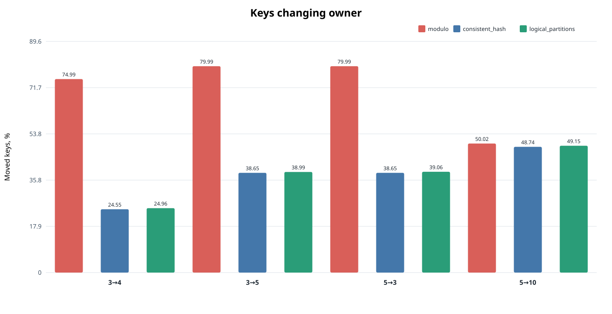
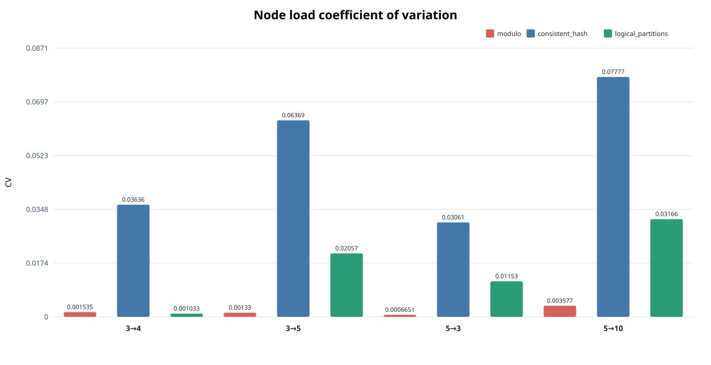
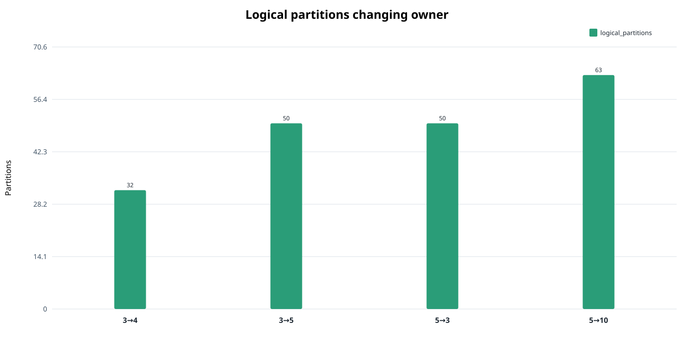

# Эпик 2: результаты сравнения partitioning

## Решение

Для дальнейшего развития системы выбран алгоритм **fixed logical partitions + explicit assignment**:

```text
partition = SHA-256(key)[0:8] % partitionCount
owner = assignment[partition]
```

В выполненном эксперименте он перемещает почти ту же долю ключей, что и consistent hashing, но обеспечивает более равномерную итоговую нагрузку, быстрее рассчитывает новое размещение и предоставляет явную управляемую единицу для epoch, fencing, migration state machine и будущего load-aware rebalancing.

Решение относится к архитектуре следующих этапов, а не к текущему runtime: Compose по-прежнему содержит три статические processing unit. Consistent hashing остаётся исследовательским baseline. Прямой `hash(key) % nodeCount` для динамической топологии далее не используется.

## Условия эксперимента

Канонический прогон выполнен 26.09.2026 автономным `benchmarks/partitioning`:

| Параметр | Значение |
|---|---:|
| База исходного дерева | `4be05de` |
| Состояние | ветка `epic/2-partitioning-research`, dirty=true |
| Go | 1.25.7 |
| ОС / архитектура | Windows / amd64 |
| Ключи | 1 000 000, детерминированные, seed 42 |
| Моделируемый размер записи | 1024 байта |
| Logical partitions | 128 |
| Virtual nodes consistent hashing | 128 на ноду |
| Повторения | 5 |
| Timing batch | 1000 построений, пакеты не менее 50 ms |
| Переходы | `3 → 4`, `3 → 5`, `5 → 3`, `5 → 10` |

Размер записи используется только для оценки `moved keys × record bytes`. PostgreSQL, сеть и работающий стенд в эксперименте не участвовали.

## Доля ключей, сменивших владельца

Каждый переход представлен одной группой из трёх столбцов: красный — modulo, синий — consistent hash, зелёный — logical partitions. Число над столбцом — процент ключей, сменивших владельца.



| Переход | Modulo | Consistent hash | Logical partitions |
|---|---:|---:|---:|
| `3 → 4` | 74.99% | **24.55%** | 24.96% |
| `3 → 5` | 79.99% | **38.65%** | 38.99% |
| `5 → 3` | 79.99% | **38.65%** | 39.06% |
| `5 → 10` | 50.02% | **48.74%** | 49.15% |

Modulo зависит непосредственно от `nodeCount`, поэтому при `3 → 4`, `3 → 5` и `5 → 3` меняет владельца примерно у 75–80% ключей. Это значительно больше доли данных, которую необходимо отдать добавленным нодам или забрать с удаляемых.

Consistent hashing переместил меньше всего ключей во всех четырёх сценариях. Преимущество над logical partitions невелико: от 0.34 до 0.41 процентного пункта. Logical partitions перемещают целые разделы, поэтому их результат определяется фактическим числом ключей в выбранных для передачи partitions и близок к минимально необходимой доле.

При записи размером 1024 байта это соответствует следующему потенциальному объёму миграции:

| Переход | Modulo | Consistent hash | Logical partitions |
|---|---:|---:|---:|
| `3 → 4` | 732.37 MiB | **239.73 MiB** | 243.74 MiB |
| `3 → 5` | 781.13 MiB | **377.44 MiB** | 380.79 MiB |
| `5 → 3` | 781.13 MiB | **377.44 MiB** | 381.40 MiB |
| `5 → 10` | 488.45 MiB | **475.97 MiB** | 480.02 MiB |

## Равномерность итоговой нагрузки

Меньший coefficient of variation означает более равномерное число ключей на нодах. Группы и цвета алгоритмов совпадают с предыдущим графиком.



| Переход | Алгоритм | Max/mean | CV |
|---|---|---:|---:|
| `3 → 4` | consistent hash | 1.0539 | 0.0364 |
| | logical partitions | **1.0009** | **0.0010** |
| `3 → 5` | consistent hash | 1.1152 | 0.0637 |
| | logical partitions | **1.0182** | **0.0206** |
| `5 → 3` | consistent hash | 1.0413 | 0.0306 |
| | logical partitions | **1.0082** | **0.0115** |
| `5 → 10` | consistent hash | 1.1083 | 0.0778 |
| | logical partitions | **1.0233** | **0.0317** |

Modulo показывает почти идеальный баланс, но достигает его ценой чрезмерного движения ключей. Logical partitions дают существенно более ровное распределение, чем consistent hashing с 128 virtual nodes: CV ниже примерно в 2.5–35 раз в зависимости от перехода. Наиболее заметен сценарий `3 → 5`, где максимальная нода consistent hashing на 11.52% тяжелее средней, а logical partitions — на 1.82%.

Баланс logical partitions не идеален, хотя число разделов на нодах отличается максимум на один. Причина — естественная разница в числе ключей между 128 partitions. Увеличение числа partitions повысит гранулярность балансировки, но увеличит размер assignment и число единиц будущей миграции.

## Переназначение logical partitions



| Переход | Переназначено | Доля от 128 |
|---|---:|---:|
| `3 → 4` | 32 | 25.00% |
| `3 → 5` | 50 | 39.06% |
| `5 → 3` | 50 | 39.06% |
| `5 → 10` | 63 | 49.22% |

При scale-out перемещается только объём partitions, требуемый новым нодам. При scale-in сохраняются все допустимые владельцы на оставшихся нодах, а переназначаются partitions удалённых нод. Для заданного целевого равномерного числа partitions эти значения минимальны.

## Стоимость расчёта placement

| Переход | Modulo, median | Consistent hash, median | Logical partitions, median |
|---|---:|---:|---:|
| `3 → 4` | 0.131 µs | 202.654 µs | **7.131 µs** |
| `3 → 5` | 0.156 µs | 261.038 µs | **7.356 µs** |
| `5 → 3` | 0.195 µs | 161.841 µs | **6.731 µs** |
| `5 → 10` | 0.711 µs | 535.162 µs | **9.461 µs** |

Modulo закономерно быстрее: он копирует список нод и не строит карту. Logical assignment рассчитывается примерно в 24–57 раз быстрее consistent hash ring в этих сценариях. Все значения малы относительно будущей физической миграции, поэтому время построения placement не является главным критерием выбора; оно подтверждает, что явная карта из 128 элементов не создаёт вычислительной проблемы.

## Анализ компромиссов

### Modulo

Преимущества: минимальная сложность, практически идеальный баланс и самый быстрый расчёт. Недостаток является определяющим: изменение `nodeCount` меняет большинство маршрутов. Алгоритм непригоден как основа управляемой динамической топологии постоянного хранилища.

### Consistent hashing

Преимущества: наименьшая доля перемещённых ключей и отсутствие отдельной таблицы на каждый ключ. Недостатки в данном эксперименте: худший баланс, зависимость результата от числа и размещения virtual nodes, более дорогой расчёт ring. Главное архитектурное ограничение — token ranges менее удобны для явного состояния partition, индивидуальной нагрузки, epoch и последовательной migration state machine.

### Fixed logical partitions

Преимущества: доля движения отличается от consistent hashing менее чем на 0.42 процентного пункта, итоговый баланс лучше, assignment компактен и детерминирован, а каждая partition становится адресуемой единицей управления. Недостатки: гранулярность ограничена числом partitions; горячая partition не устраняется простым равным количеством partitions; изменение `partitionCount` потребует отдельного resharding.

## Выбранное направление

Следующие runtime-этапы должны использовать fixed logical partitions:

1. `partitionCount` остаётся независимым от числа processing unit; исходное значение — 128, но параметр сохраняется конфигурируемым.
2. Assignment хранится и публикуется как отдельный версионируемый снимок `partition → node`.
3. Новый assignment сначала рассчитывается, затем применяется отдельным протоколом миграции; вычисление placement не означает завершённый перенос.
4. Epoch/fencing должны запретить запись от имени устаревшего владельца до включения динамической топологии.
5. Первоначальный allocator минимизирует число перемещённых partitions при равном их количестве на ноду.
6. Load-aware allocator позднее заменит равный счётчик на функцию стоимости с наблюдаемой нагрузкой, размером данных, capacity нод и migration cost.
7. Consistent hashing остаётся baseline следующих экспериментов, но не выбранной runtime-моделью.

## Ограничения вывода

- Проверен один детерминированный набор равномерных ключей и один seed.
- Все записи имеют одинаковый моделируемый размер; реальное распределение байтов не измерялось.
- Баланс оценивается по числу ключей, а не по CPU, RPS или latency partitions.
- Не проверялись Zipf, hot partition и moving hot partition.
- Не измерялись сеть, диск, p95/p99 во время миграции и unavailable time.
- Репликация и failure domains не моделировались.
- Результат consistent hashing зависит от настройки 128 virtual nodes; другие значения нужно исследовать отдельно.
- Результаты wall-clock относятся к указанному локальному окружению и не являются production benchmark.

Поэтому эксперимент обосновывает выбор модели placement, но не доказывает безопасность динамического rebalancing. Следующая обязательная граница перед изменяемым runtime — публикация assignment, монотонный epoch и fencing stale writes.
